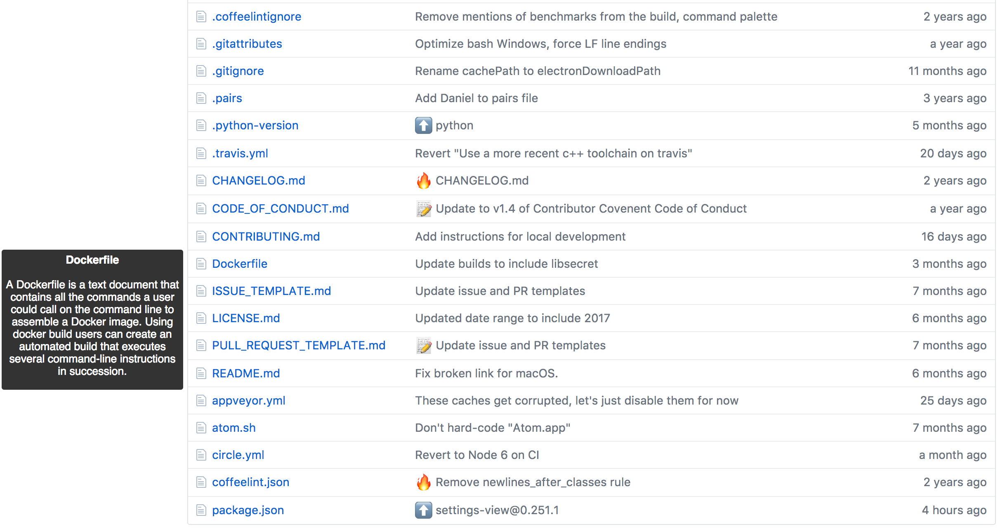

# FileWhat

This is a Chrome Extension which adds a simple tooltip to common filenames in any Github repository, with a brief explanation of what the file is used for, and some possible resources for learning more.

With more and more tools showing up in our toolbelts everyday, it can feel a little onerous when viewing a project using many things you've never seen before. This extension helps by reducing the legwork it takes to ask, "What is this file for?"

Think of it as a Grok helper.

Here is a Github repository list without FileWhat

Here is one with FileWhat

So helpful!